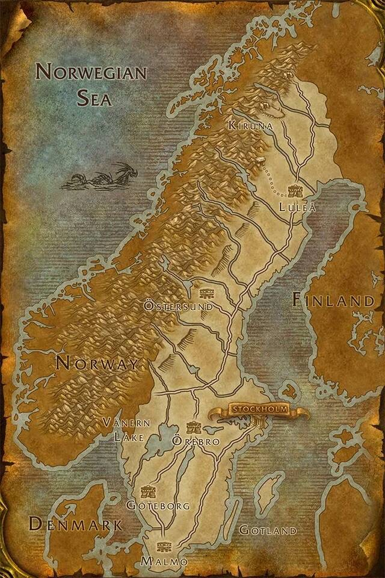

## Project
**Sweden Tweeting and Social problems**.


<!---  --->

## Task description
We have a **pool of questions** and **two datasets** to use to find answers in empirical way.

Substantive **methodological frame** presumes that "tweeting" (as the form of social interaction,
  or a public space, or a space where people complain) is a proxy indicator of social problems.
  Shortly saying, if people text about problem, problem _could_ exist.

**Gathering of datasets were outsourced**, same for some methodological features (i.e.
  categories of problems and their respective "keywords" were provided)

Current **report available**, see [[html]](https://htmlpreview.github.io/?https://github.com/Witold1/quilt_test_task/blob/master/reports/Report_final.html) [[ipynb]](https://nbviewer.org/github/Witold1/quilt_test_task/blob/master/notebooks/Report_final.ipynb)
<!--- Current **raw report available** on demand. --->

## Selected charts

<table>
<thead>
  <tr>
    <th></th>
    <th></th>
  </tr>
</thead>
<tbody>
  <tr>
    <td colspan="2"></td>
  </tr>
</tbody>
</table>

## Structure of repository
```
Project structure:
+--data                       <- folder for datasets
¦  L--raw                       <- ... 1. raw data
¦  L--interim                   <- ... 2. auxiliary, generated, temporary, preprocessed data
¦  L--processed                 <- ... 3. final, ready-to-analysis data
¦  L--external                  <- ... +. additional datasets
¦  
+--notebooks                  <- folder for *.ipynb files
¦  L--*.ipynb 1                 <- ... file 1
¦
+--src                        <- folder for .py scripts
¦  L--*.py 1                    <- ... file 1
¦  L--*.py 2                    <- ... file 2
¦  L--*.py 3                    <- ... file 3
¦
+--figures                    <- folder for charts and images to reports
¦
+--reports                    <- folder for reports (i.e. *.pptx, *.html, *.ipynb)
¦
+--docs                       <- folder for documentation files
¦
+--README.md
```

## Links
* Placeholder
<!--- * Feature engineering. Preprocessing. Charts [Here](https://nbviewer.org/) --->

## License and legals
Ask before use.
